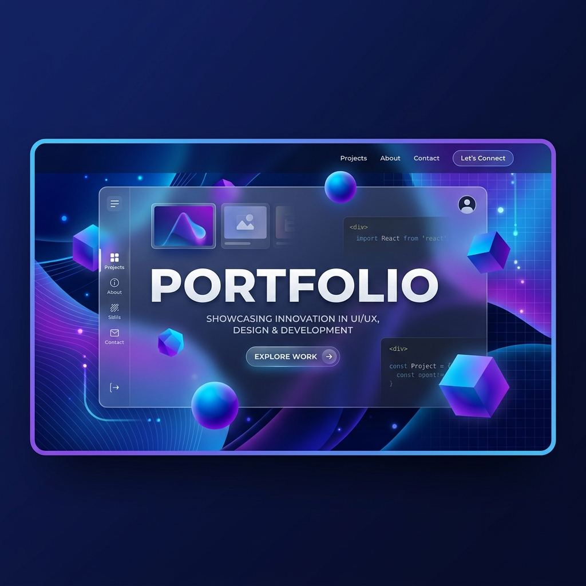

# Faturrahman Alharitszoe — Premium Glassmorphism Portfolio



A high-performance, professional portfolio website built with **React**, featuring a modern **Glassmorphism UI** and **Dual-Mode Rendering Architecture**. This project is optimized for 60fps performance on all devices, including mobile and systems with integrated graphics.

## 🚀 Key Features

- **Dual-Mode Rendering Architecture**: 
  - **Desktop**: Rich 3D Parallax experience using `@react-spring/parallax`.
  - **Mobile**: High-performance Vertical Stack layout for maximum stability and speed.
- **Ultra-Performance Optimization**: 
  - Achieves solid 60fps by replacing expensive CSS filters with lightweight **Radial Gradients**.
  - Tuned 4px backdrop-blur system for a premium look without the GPU overhead.
  - Strict hardware acceleration using `translate3d` and isolated render layers.
- **Interactive Glassmorphism UI**: 
  - Dynamic hover effects and smooth transitions using **Framer Motion**.
  - Custom-built glass cards with hardware-accelerated animations.
- **Responsive Navigation**:
  - Professional Contact Dropdown with integrated WhatsApp, LinkedIn, and Email links.
  - Scroll-spy enabled smooth navigation between sections.
- **Experience Slider**: 
  - Adaptive carousel for professional journey visualization using `react-slick`.

## 🛠️ Tech Stack

- **Framework**: [React.js](https://reactjs.org/)
- **Styling**: [Tailwind CSS](https://tailwindcss.com/)
- **Animations**: [Framer Motion](https://www.framer.com/motion/) & [React Spring](https://www.react-spring.dev/)
- **Components**: React Slick, FontAwesome 6
- **Performance**: GPU-accelerated CSS, Radial Gradient Masking

## 📦 Getting Started

### Prerequisites
- Node.js (v16 or higher)
- npm or yarn

### Installation
1. Clone the repository:
   ```bash
   git clone https://github.com/faturrahmanalharitszoe/portfolio-website.git
   ```
2. Install dependencies:
   ```bash
   npm install
   ```
3. Run the development server:
   ```bash
   npm start
   ```

## 📈 Performance Engineering
This portfolio was specifically engineered to overcome the common performance bottlenecks of Glassmorphism. By utilizing "Deep Isolation" techniques (`contain: content`) and offloading heavy paint operations to the GPU, we've ensured that even mid-range mobile devices deliver a buttery-smooth experience.

---
Designed and Developed with ❤️ by **Faturrahman Alharitszoe**
